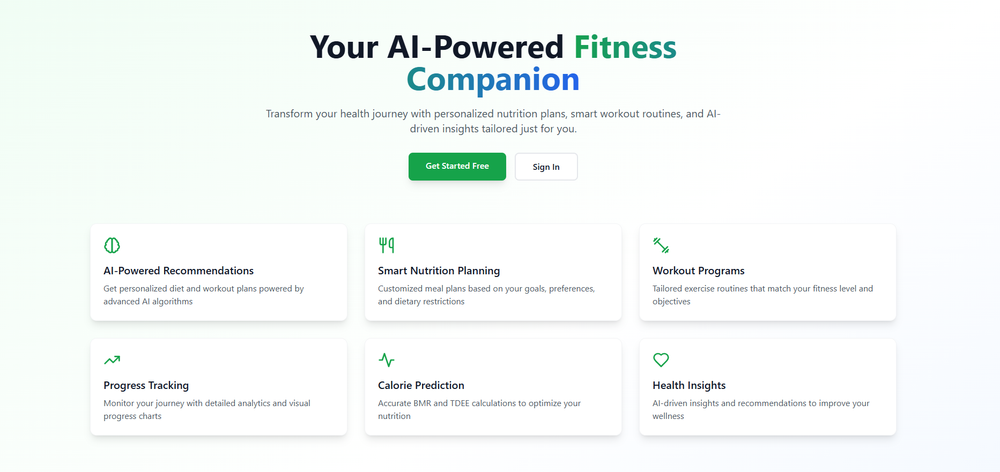
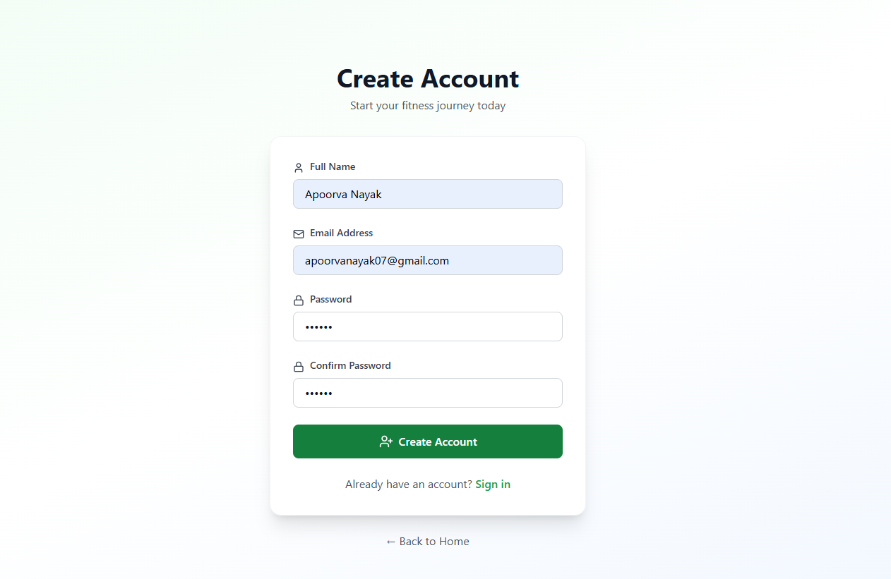
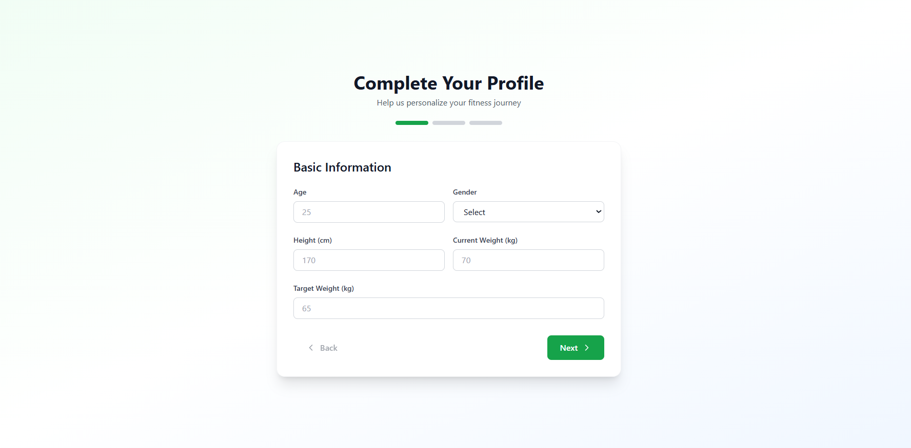
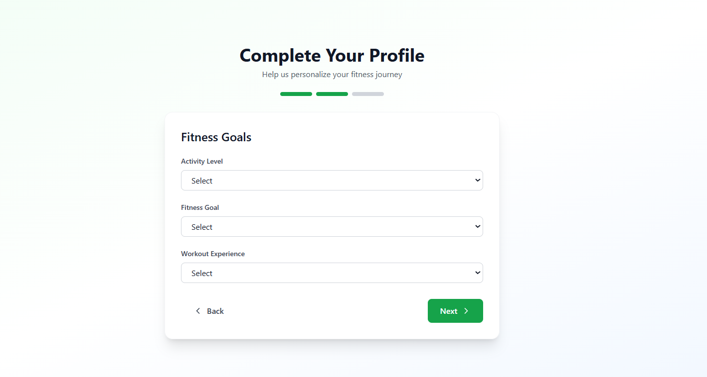
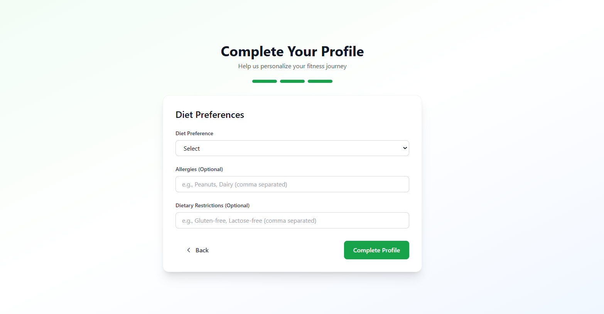
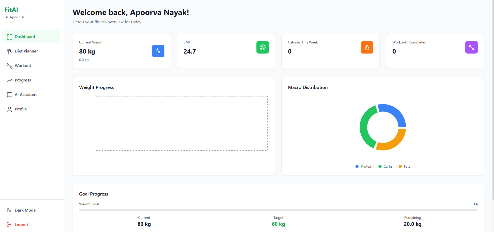
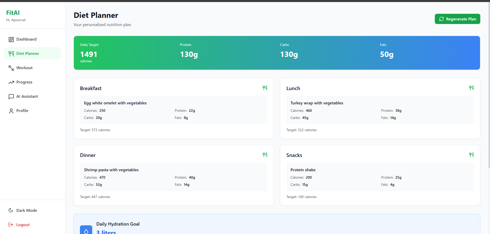
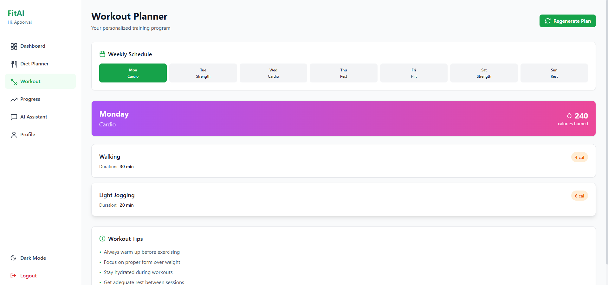
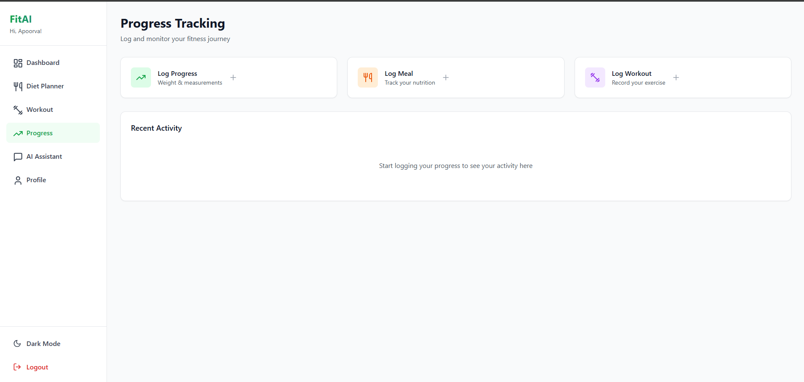
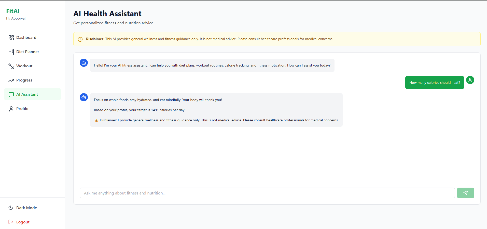

# 🏋️ FitAI : AI-Powered Nutrition & Fitness Recommendation System

A production-grade, full-stack AI-powered health and fitness platform that provides personalized diet plans, workout routines, calorie predictions, and AI-driven health insights.


## Screenshots

### Landing page


### Registration page


### Profile completion






### Dashboard


### Diet Planner


### Workout Planner


### Progress Tracking


### AI Assistant


## ✨ Features

### 🎯 Core Features
- **AI-Powered Recommendations** - Personalized diet and workout plans using ML algorithms
- **Calorie Prediction** - Accurate BMR, TDEE, and target calorie calculations
- **Smart Diet Planning** - Customized meal plans based on goals and preferences
- **Workout Programs** - Tailored exercise routines for all fitness levels
- **Progress Tracking** - Comprehensive analytics with visual charts
- **AI Health Assistant** - Chatbot for fitness guidance and motivation
- **Real-time Analytics** - Interactive dashboards with Recharts

### 🎨 UI/UX Features
- Modern, clean HealthTech design
- Light/Dark mode support
- Smooth animations with Framer Motion
- Fully responsive design
- Professional gradient themes
- Intuitive navigation

### 🔐 Security Features
- JWT authentication
- Password hashing with bcrypt
- Protected API routes
- Input validation
- Secure environment variables

## 🛠️ Tech Stack

### Frontend
- **React 18** - UI library
- **Tailwind CSS** - Styling
- **Framer Motion** - Animations
- **Recharts** - Data visualization
- **Zustand** - State management
- **Axios** - HTTP client
- **React Router** - Navigation
- **Vite** - Build tool

### Backend
- **Node.js** - Runtime
- **Express.js** - Web framework
- **MongoDB** - Database
- **Mongoose** - ODM
- **JWT** - Authentication
- **bcryptjs** - Password hashing

### ML Service
- **Python 3.11** - Language
- **FastAPI** - API framework
- **NumPy** - Numerical computing
- **Pandas** - Data manipulation
- **Scikit-learn** - ML algorithms

### DevOps
- **Docker** - Containerization
- **Docker Compose** - Multi-container orchestration
- **NGINX** - Reverse proxy

## 📋 Prerequisites

- Node.js 18.x or higher
- Python 3.11 or higher
- MongoDB 7.0 or higher
- Docker & Docker Compose (optional)

## 🚀 Quick Start

### Option 1: Manual Setup

#### 1. Clone the repository
```bash
git clone <repository-url>
cd fitness-ai-system
```

#### 2. Install dependencies
```bash
# Install root dependencies
npm install

# Install all project dependencies
npm run install-all
```

#### 3. Setup environment variables

**Backend (.env in server folder):**
```bash
cd server
cp .env.example .env
# Edit .env with your configuration
```

**Frontend (.env in client folder):**
```bash
cd client
cp .env.example .env
# Edit .env with your configuration
```

#### 4. Start MongoDB
```bash
# Using Docker
docker run -d -p 27017:27017 --name mongodb mongo:7.0

# Or use local MongoDB installation
mongod
```

#### 5. Start all services
```bash
# From root directory
npm run dev
```

This will start:
- Frontend: http://localhost:3000
- Backend: http://localhost:5000
- ML Service: http://localhost:8000

### Option 2: Docker Setup

#### 1. Build and start all services
```bash
docker-compose up --build
```

#### 2. Access the application
- Frontend: http://localhost:3000
- Backend API: http://localhost:5000
- ML Service: http://localhost:8000
- MongoDB: localhost:27017

## 📁 Project Structure

```
fitness-ai-system/
├── client/                 # React frontend
│   ├── src/
│   │   ├── components/    # Reusable components
│   │   ├── pages/         # Page components
│   │   ├── layouts/       # Layout components
│   │   ├── services/      # API services
│   │   ├── store/         # State management
│   │   ├── utils/         # Utility functions
│   │   ├── App.jsx        # Main app component
│   │   └── main.jsx       # Entry point
│   ├── public/            # Static assets
│   └── package.json
│
├── server/                # Node.js backend
│   ├── config/           # Configuration files
│   ├── controllers/      # Route controllers
│   ├── middleware/       # Custom middleware
│   ├── models/           # Mongoose models
│   ├── routes/           # API routes
│   ├── services/         # Business logic
│   ├── utils/            # Utility functions
│   ├── server.js         # Entry point
│   └── package.json
│
├── ml-service/           # Python ML service
│   ├── models/          # ML models
│   ├── routes/          # API routes
│   ├── utils/           # Utility functions
│   ├── app.py           # FastAPI app
│   └── requirements.txt
│
├── docker/              # Docker configurations
│   ├── Dockerfile.backend
│   ├── Dockerfile.frontend
│   ├── Dockerfile.ml
│   └── nginx.conf
│
├── docs/                # Documentation
├── docker-compose.yml   # Docker Compose config
├── package.json         # Root package.json
└── README.md           # This file
```


## 🔧 Configuration

### Environment Variables

#### Backend (.env)
```env
PORT=5000
MONGODB_URI=mongodb://localhost:27017/fitness-ai
JWT_SECRET=your_secret_key
JWT_EXPIRE=7d
NODE_ENV=development
ML_SERVICE_URL=http://localhost:8000
```

#### Frontend (.env)
```env
VITE_API_URL=http://localhost:5000/api
```

## 📊 Features Breakdown

### 1. Authentication System
- User registration and login
- JWT token-based authentication
- Password hashing
- Protected routes

### 2. Health Profile Management
- Comprehensive user profile
- BMI, BMR, TDEE calculations
- Goal tracking
- Activity level monitoring

### 3. Diet Planning
- Personalized meal plans
- Calorie distribution
- Macro nutrient tracking
- Diet preference support
- Allergy management

### 4. Workout Planning
- Experience-based routines
- Goal-oriented programs
- Weekly schedules
- Exercise library
- Calorie burn estimation

### 5. Progress Tracking
- Weight tracking
- Meal logging
- Workout logging
- Visual analytics
- Historical data

### 6. AI Assistant
- Natural language processing
- Context-aware responses
- Fitness guidance
- Motivation support
- Health disclaimers

